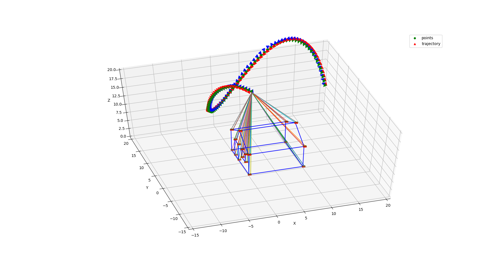

# VIO Data Simulation

IMU和Camera数据仿真，用于VIO算法测试。

这份代码是<https://github.com/HeYijia/vio_data_simulation>的一个fork。

## 编译和运行

依赖：

1. CMake >= 3.13
2. 支持C++17标准的编译器
3. Python 3，并装有numpy和matplotlib。默认使用TkAgg可视化，请根据环境修改.py文件。

## 坐标系

- **B**ody frame: IMU坐标系

- **C**am frame: 相机坐标系

- **W**orld frame: 第一帧的IMU坐标系

- **N**avigation frame: NED（东北天）或ENU（北东地）,本代码采用的是ENU，重力向量在该坐标系下为$(0,0,-9.81)$

目前，IMU的z轴向上，xy平面内做椭圆运动，z轴做正弦运动，x轴沿着圆周向外。外参数Tbc将相机坐标旋转，使得相机朝向特征点。

## 代码结构

include/imu.h：IMU数据项的结构，IMU数据生成器的结构。

include/param.h：IMU噪声参数，IMU频率，相机内参数等等。

include/utility.h：读取和写入数据的函数。

utils/generate_data.cpp：用于生成IMU数据，相机轨迹，特征点像素坐标，特征点的3d坐标。

python/draw_points.py：动态绘制相机轨迹和观测到的特征点。

python/draw_trajectory.py：绘制真实轨迹、无噪声积分得到的轨迹、有噪声积分得到的轨迹。

## 数据存储的格式

### 3D点

> x, y, z, 1

### 特征点

> x, y, z, 1, u, v

### 2D线段

> u1, v1, u2, v2

### IMU Poses

> t, px, py, pz, qx, qy, qz, qw, ax, ay, az, gx, gy, gz, bax, bay, baz, bgx, bgy, bgz

### IMU Poses TUM Format

> t, px, py, pz, qx, qy, qz, qw

## Simulation for direct tracking

To cope with direct tracking, image data instead of distinct point should be generated. Thus we modify the project to generate corresponding frames.
